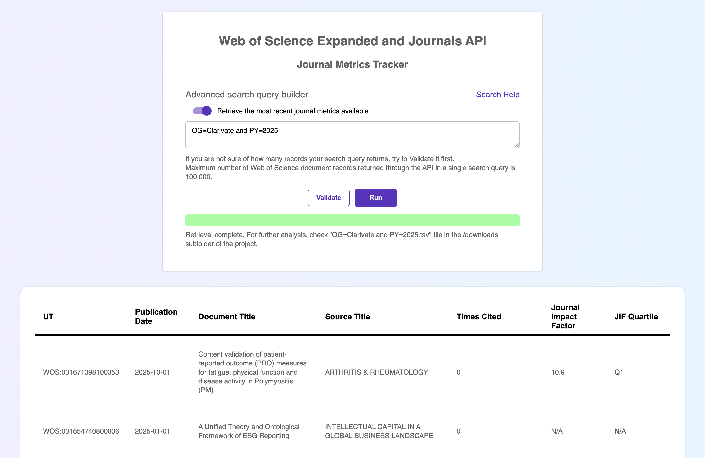
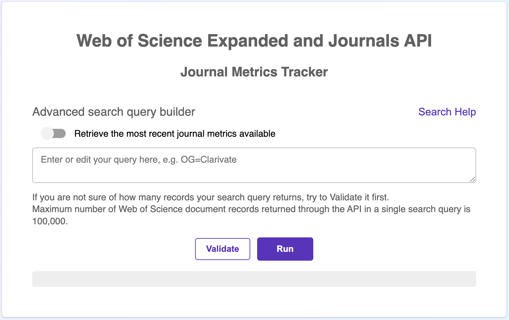

# Web of Science Journal Metrics Tracker
### Using Web of Science Expanded API and Journals API



## Overview

This is a JavaScript application with a simple graphical user interface that demonstrates how to link journal publications to their corresponding **Journal Impact Factors (JIFs)** and **Journal Impact Factor Quartiles** using the **Web of Science Expanded API** and **Journals API**.

The application is designed to showcase how data from multiple Clarivate APIs can be combined to produce custom, article-level reports enriched with journal-level metrics.

## Important note on the use of journal metrics

As a company we do **not** encourage the use of journal-level metrics to evaluate the quality or impact of individual research papers. Journal Impact Factors describe journals as a whole and are influenced by many factors; they are **not a proxy for the impact of a specific research output**.

For readers interested in the methodological background and limitations of journal metrics, the following scholarly publications provide useful context:

- [Bornmann L., Marx, W., Gasparyan, A.Y., Kitas G.D. (2012). Diversity, value and limitations of the journal impact factor and alternative metrics. **Rheumathology Journal**, 32, 1861-1867.](https://link.springer.com/article/10.1007/s00296-011-2276-1)
- [Garfield, E. (2006). The History and Meaning of the Journal Impact Factor. **JAMA**, 295(1): 90-93, DOI:10.1001/jama.295.1.90.](https://jamanetwork.com/journals/jama/article-abstract/202114)
- [Seglen, PO. (1997) Why the impact factor of journals should not be used for evaluating research. **BMJ**, 314, 497, DOI:10.1136/bmj.314.7079.497.](https://www.bmj.com/content/314/7079/497.1.full)

Requests for viewing journal metrics alongside individual articles within a single interface have existed for a long time. While this functionality is intentionally not a part of the Web of Science platform itself, it is technically possible to generate such reports by accessing Web of Science Core Collectiona and Journal Citation Reports data via their respective APIs.

This app illustrates how that can be done.

## What the application does

The application allows you to:

1. Submit an **Advanced Search query** to Web of Science Core Collection via **Web of Science Expanded API**
2. Retrieve publication-level metadata
3. Query the **Journals API** to obtain relevant journal metrics
4. Render a combined table showing:
    - document metadata
    - Journal Impact Factor values
    - best quartile values for the journals
5. Export the results as a **tab-delimited (.tsv) file**.

## How to use

### 1. Set up API keys

Download the code and open the project folder.

Create a file called `apikeys.js` in the root folder and define two constants:.

```
export const EXPANDEDAPIKEY = "yourWebOfScienceExpandedAPIKey";
export const JOURNALSAPIKEY = "yourJounralsAPIKey";
```

### 2. Install dependencies

The application relies on the following packages:

- Axios
- Express
- EJS
- Nodemon

Install them using your preferred package manager.

### 3. Run the application

Start the development servier with:

```
nodemon index.js
```

The application will be available at:

```
http://127.0.0.1:3000
```

This is what the start page looks like:



### 4. Using the interface

On the start page, enter a **Web of Science Core Collection Advanced Search query**. For example, to retrieve publications afiliated with Clarivate between 2021 and 2024:

```
OG=Clarivate and PY=2021-2024
```

(You can replace Clarivate with your own organization name.)

And then choose whether you want:
- Journal Impact Factors corresponding to the **publication year**, or
- the **most recent available** Journal Impact Factor

Click **Run** to start the data retrieval.

### Notes and limitations

- Journal Impact Factors for a given publication year typically become available in the **summer of the following year**. Metrics for very recent publications may therefore be unavailable.
- The Web of Science Expanded API has a **maximum limit of 100,000 document records per query**. If you are unsure about the result size, it is recommended to validate your search by pressing the `Validate` button.

Progress is displayed viaa progress bar on the page while data is being retrieved.

## Output

Once processing is complete:

- The page refreshes and displays an HTML table containing key publication details, including Journal Impact Factor values and quartiles.
- A .tsv gile with the same dta is saved to the /downloads/ subfolder.

## Purpose and scope

This application was created to **demonstrate the capabilities of Web of Science APIs and custom XML data workflows**. It is **not a commercial product of Clarivate** and is not maintained with the same update cadence or support guarantees as Clarivate's production platforms.

It is not recommended to use this application as a ready-made solution for:

- formal reporting
- research evaluation
- finding or grant decision-making

We do, however, encourage the bibliometric community to:

- provide feedback
- adapt the script
- use it as a starting point for more advanced analytical projects

## Looking for a production solution?

For a consistent experience, intuitive user interfaces, and full customer support, please refer to our products such as Web of Science, InCites Benchmarking & Analytics, and Journal Citation Reports.
