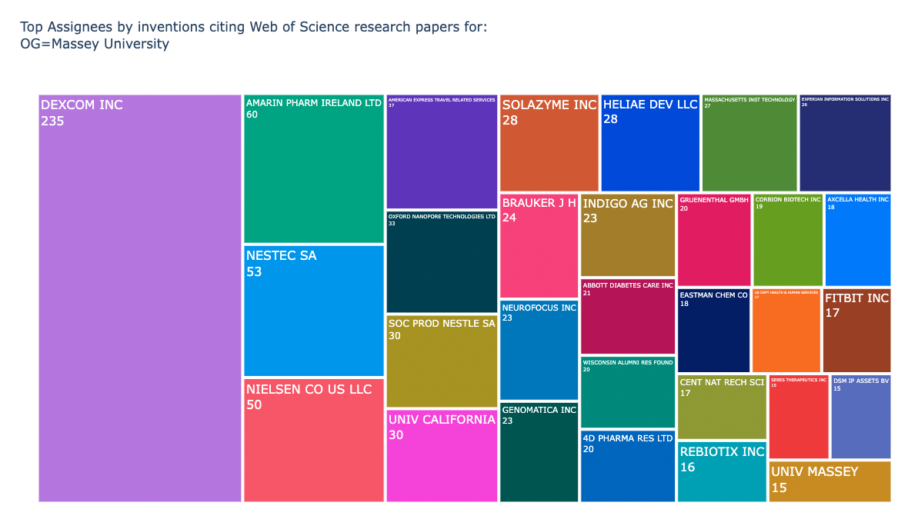
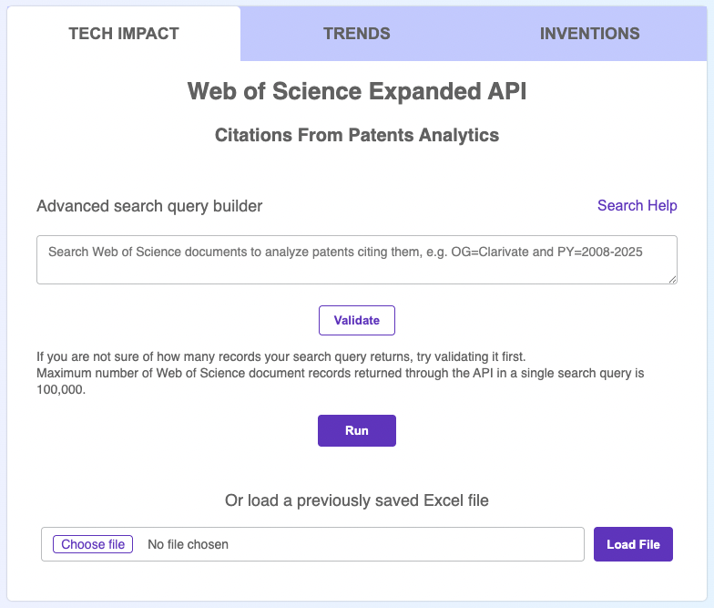
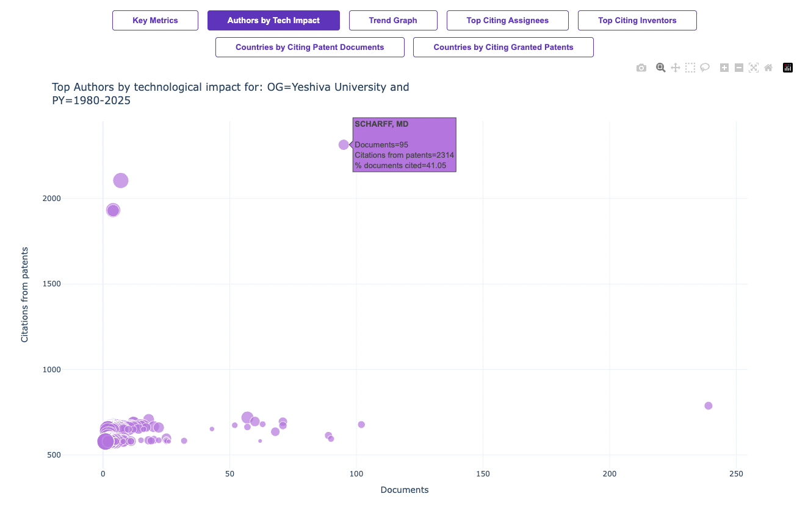
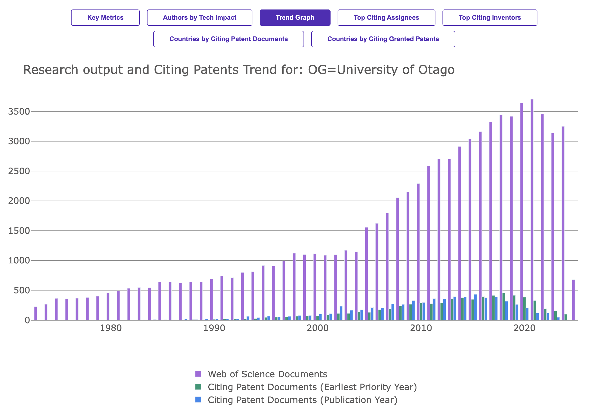
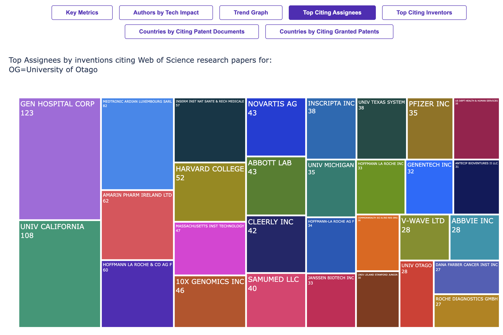
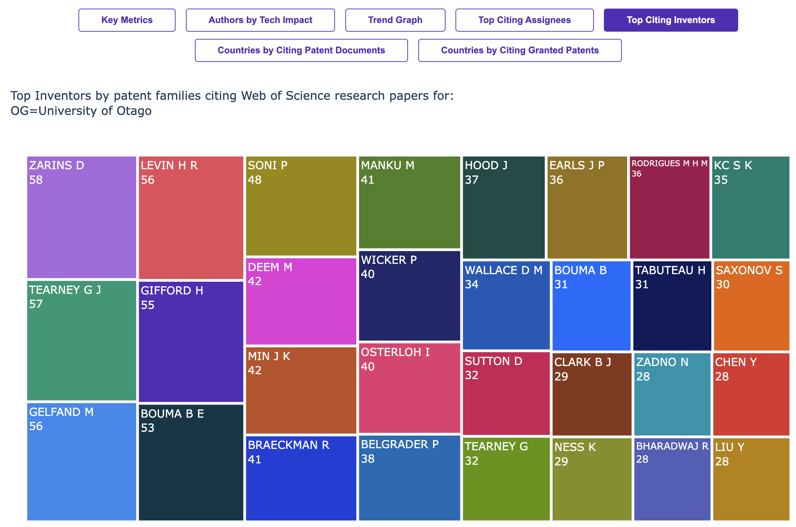
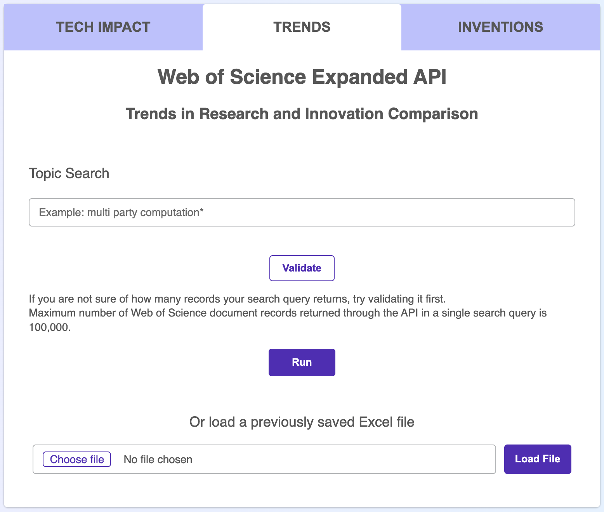
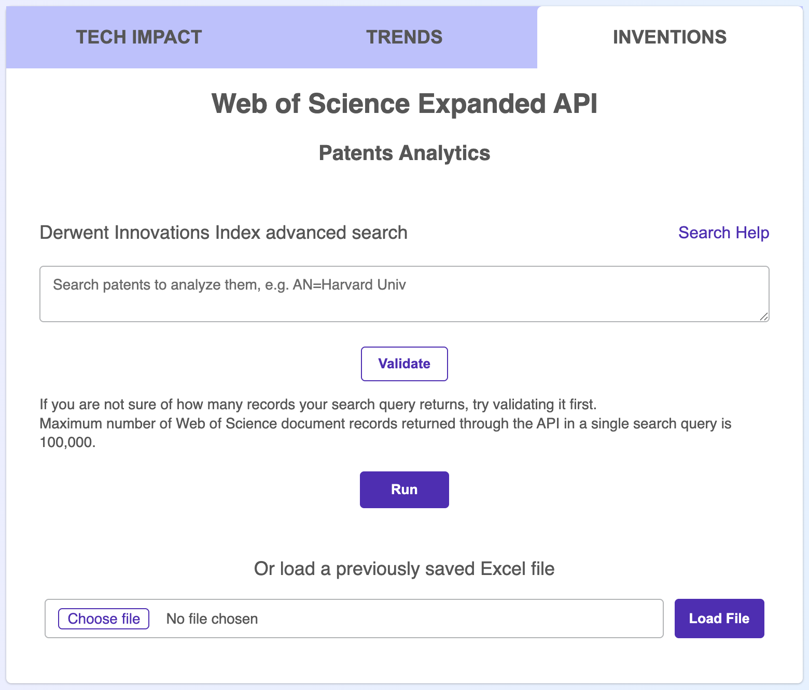
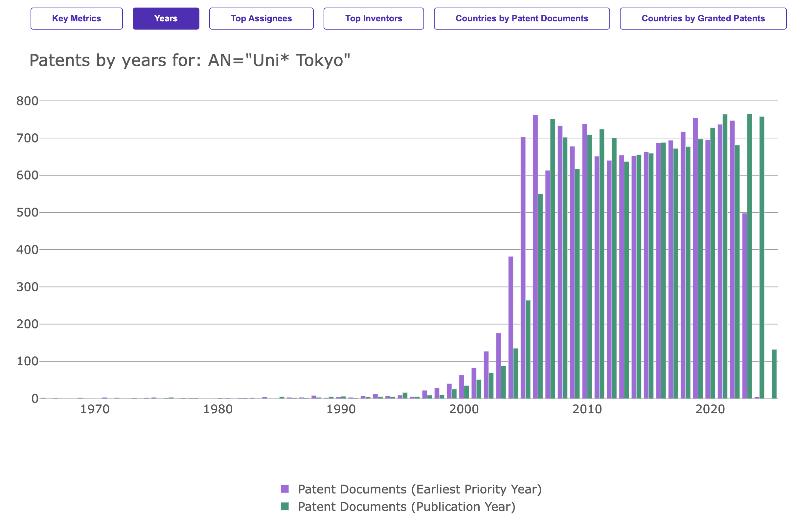
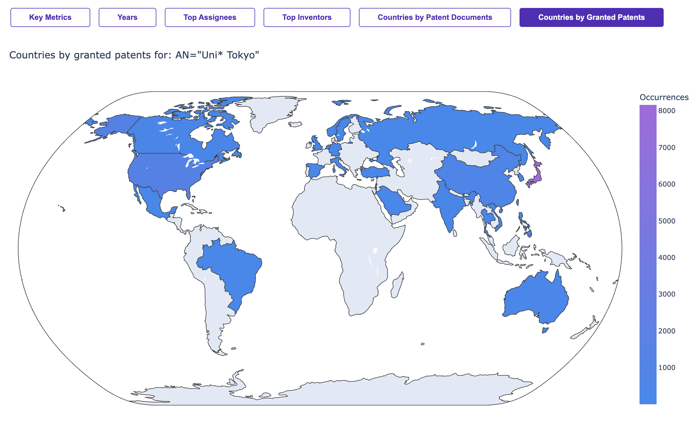

# Citation Impact Analytics via Web of Science Expanded API



## A Flask application with a simple graphical user interface to analyse and visualise the patents and citations from patents data from Web of Science Core Collection and Derwent Innovations Index. The application retrieves the data using Web of Science Expanded API.

This application allows to analyse:
- assignees and inventors that were citing your research in their patent documents;
- who are the authors in your organization that have the highest technological impact;
- geographical distribution of the patent documents associated with these inventions.
- trends in research and innovation;
- patent-related metrics, such as patent application success rate and quadrilateral inventions.

The application retrieves metadata using Web of Science Expanded API, visualises it in a variety of ways with Plotly package, and saves them into an Excel spreadsheet.

### How to use it
Download the code, open the project folder where you saved it and create a python file `apikeys.py` right in the project folder. There, you need to create a constant representing your Web of Science Expanded API key and pass its value as a string like in the example below:

```
EXPANDED_APIKEY = 'mYw3b0f$c14nc33xp4nd3d4p1k3y1$4$3cr37'
```

You might also need to install the project dependencies, which are:
- Flask;
- Pandas (and openpyxl);
- Requests;
- Plotly.

And launch the app.py file. Flask will create a development server on http://127.0.0.1:5000 which you can open locally in any browser. This is what the start page looks like:



You can switch between the "TECH IMPACT", "TRENDS", and "INVENTIONS" tabs on top o the page to access different search and analytical functionality. 

#### TECH IMPACT tab

On this page, you can enter a Web of Science Core Collection Advanced Search query, i.e., for an affiliation search on Clarivate for publication year of 2000-2025 (you can simply replace Clarivate with your organisation name):

```
OG=Clarivate and PY=2000-2025
```

And press the "Run" button. Please note that as Web of Science Expanded API has a limit of 100,000 records to be retrieved per search query, it is a good idea to validate your search if you're not sure how many records it's going to return.

The data retrieval should take quite some time. Because the application will first retrieve all the Web of Science document IDs and their patent citation counts, then retrieve the IDs of each citing patent document, and then based on the document IDs it will retrieve the patent document metadata, the data retrieval might take some time but the process can easily be run in the background. You can track the progress in your Python window or in the Run view of your IDE if you're launching the program from there. 

When the data extraction is complete, the program will refresh the page and add the key metrics summary as well as interactive visualisation plots with Plotly which you can switch between. It will also save an Excel file with all the metadata retrieved into a /downloads/woscc/ subfolder of the project folder.

You can also use the Load a Previously Saved Excel File form to visualise previously saved files.

These are some of the examples of the visualisations:









#### TRENDS tab



On this page, you can enter a simple Web of Science Core Collection topical search query, i.e.:

```
exosome*
```

And press the "Run" button. Just like on the other tabs, Web of Science Expanded API has a limit of 100,000 records to be retrieved per search query, it is a good idea to validate your search if you're not sure how many records it's going to return.

The application will query both Web of Science Core Collection and Derwent Innovations Index with the same topical search you provided, retrieve the scholarly and patent documents, fetch their publication years (and, to take the patent publication lag factor into account), earliest priority year for the patents. You can track the progress in your Python window or in the Run view of your IDE if you're launching the program from there. 

When the data extraction is complete, the program will refresh the page and add an interactive trend graph with Plotly representing the research (purple columns) and innovation (green and blue columns) trends for the same topic. It will also save an Excel file with the trend data into a /downloads/trends/ subfolder of the project folder.


You can also use the Load a Previously Saved Excel File form to visualise previously saved searches.

Here is an example of the visualisation:


#### INVENTIONS tab



On this page, you can enter a Derwent Innovations Index Advanced Search query, i.e., for an assignee search on Harvard University (you can simply replace Harvard Univ with your organisation's concatenated name):

```
AN=Harvard Univ
```

And press the "Run" button. Again, please note that as Web of Science Expanded API has a limit of 100,000 records to be retrieved per search query, it is a good idea to validate your search if you're not sure how many records it's going to return.

The application will query Derwent Innovations Index for the patent documents. You can track the progress in your Python window or in the Run view of your IDE if you're launching the program from there. 

When the data extraction is complete, the program will refresh the page and add the key metrics summary as well as interactive visualisation plots with Plotly which you can switch between. It will also save an Excel file with all the metadata retrieved into a /downloads/dii/ subfolder of the project folder.


You can also use the Load a Previously Saved Excel File form to visualise previously saved files.

These are some of the examples of the visualisations:






This application was created to demonstrate the capabilities of Web of Science APIs and custom XML data, and is not a commercial product of Clarivate. It will be reviewed and updated in the future but it will not have the same regular update frequency we normally offer for our commercial products. We do not recommend using this application as a ready-made solution as it is for reporting purposes or for supporting important grant funding decisions. We however encourage the bibliometric community provide feedback on improving this script and to use the script as a base for more advanced analytical projects.

For a consistent experience, intuitive user interface and world-class customer support, please refer to our products like Web of Science, InCites Benchmarking & Analytics, and Journal Citation Reports.
